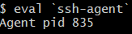
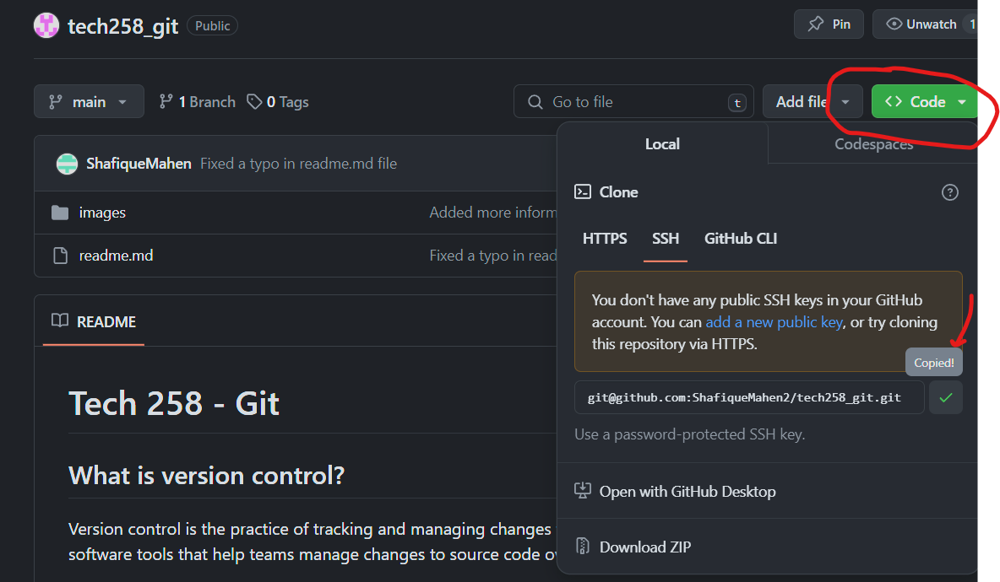

# Tech 258 - SSH
## How does SSH work?
SSH can be explained with the Key and Lock concept. This means that in order to get into our remote server we must have the right credentials. If we have the right credentials (the right private key), we can unlock our server's lock (the server's public key). Once this has occurred, a secure communication can be established between the two services over the internet! This concept can be shown in the image below:

## Step 1 - Create SSH Key Pair
In order for SSH to be able to take place, we have to generate a SSH Key Pair so we can access the repo on GitHub (Public Key) with our corresponding private key. To do this, we must go into the `.ssh/` directory as this is where our SSH key pairs are stored. To do this, execute the command below:
```commandline
cd ~/.ssh/
```
Now that we are in the right place, we can execute the `ssh-keygen` command to generate the key pair. An example usage has been shown below:


Once the command is entered, you will be prompted for:

- A filename in which to save the key inside the `.ssh/` directory.
- A passphrase (and a confirmation). If you don't want a passphrase, just use enter to move ahead.

An example can be seen below:


To see if our key was created properly we can run the following command: <br>
`cat <key_name>.pub`

**REMEMBER**: The version of the key with the `.pub` extension is our public key, the one without it is our private key!

Example usage:


Once completed, make sure you exit the `.ssh/` directory in order to prevent security risks! This can be done with the following command (which will take you to your home directory):
```commandline
cd ~
```
## Step 2 - Put our Public Key as our Deploy Key for our GitHub Repo
Now that we have generated the key pair, we must give our desired repo the public key as that is the endpoint we want to clone from. To do this:

- Go to your GitHub Repo and click on the Settings Tab

- Under the Security section, click Deploy Keys

- Click Add Deploy Key
- Add the Public Key and give a Title (Make sure to Allow write access, so we can push to the repo in future!)

## Step 3 - Set up SSH-Agent
Now we must set up our SSH-Agent to continue! This is essentially storing our SSH key onto a keyring, so we can use the key without having to be inside the `.ssh/` directory.

Firstly, we must create an SSH-Agent process using the command `eval`, with ssh-agent as a field: <br>


If done correctly, we are given the Agent pid!

Now that our process has started we must now add the private SSH key to our agent for use. This is done using the `ssh-add` command:


To test if a connection can be established we can run the command `ssh` with the `-T` flag:


## Step 4 - Clone Repo using SSH
Now that we have successfully set up SSH for our repo we can now clone using SSH! Firstly, lets grab the SSH Clone link for our repo! This can be done as shown below:


Now that we have the repo link, we can clone it using the following command:
```
git clone <git_repo_here.git>
```
Example usage:


Our cloned repo will be saved in a directory which will have the same name as our repo!